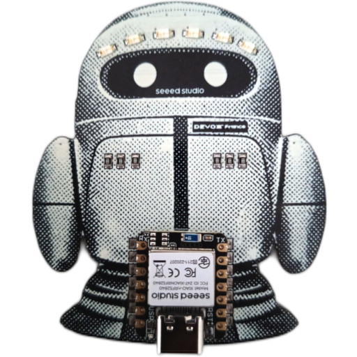

# ROBOT BADGE

A badge firmware written in C++ for the [Seeed Studio XIAO nRF52840](https://www.seeedstudio.com/Seeed-XIAO-BLE-nRF52840-p-5201.html), shaped as a small robot. The badge features six LEDs above the eyes (three green and three red) along with an onboard RGB LED and a [BLE](https://en.wikipedia.org/wiki/Bluetooth_Low_Energy) connectivity.



## DESCRIPTION

This firmware runs on a Seeed XIAO nRF52840 module powered by a CR2032 coin cell. It is an independent rewrite inspired by the [DevoxxFrance-2026-Meet-And-Chip](https://github.com/hgomez/DevoxxFrance-2026-Meet-And-Chip) project by [Paul Pinault](https://www.linkedin.com/in/paulpinault/) and [Henri Gomez](https://www.linkedin.com/in/gomezhe/), two friends of mine.

Paul Pinault and Henri Gomez led an electronics introduction workshop titled *Meet & Chip – la rencontre sous tension* at Devoxx France 2026, aimed at developers. In this workshop, attendees discovered the basics by assembling and soldering a programmable badge designed to foster community exchanges. Led by two IoT experts, the workshop covered theory, practice, component selection, soldering and code, and each attendee left with their own working badge and hands-on knowledge.

Many thanks to Paul and Henri for kindly giving me one of these badges so I could experiment with it and build this firmware on top of their work.

The board is built around a Nordic nRF52840 SoC (Cortex-M4F, BLE 5.0) and uses the Adafruit nRF52 Arduino core via PlatformIO.

This firmware drives the badge LEDs through three different animation modes, each highlighting a distinct visual pattern on the eye LEDs and the onboard RGB LED. The active mode rotates automatically every 30 seconds, and can also be switched on demand from the serial console.

This project ships with a `Makefile` that wraps every step of the firmware lifecycle on top of the PlatformIO CLI. The available targets are:

| Target        | Description                                                                          |
|---------------|--------------------------------------------------------------------------------------|
| `all`         | Build the firmware (default target).                                                 |
| `clean`       | Remove all build artefacts.                                                          |
| `upload`      | Flash the firmware to the board.                                                     |
| `monitor`     | Open a serial connection to the board for live console output.                       |
| `mrproper`    | Wipe the working tree using `git clean -f -d -x`. **Dangerous, use with caution.**   |

## WIRING

The nine LEDs of the badge are mapped to the following pins:

| Logical name | XIAO pin    | Color / role                   | Control                     |
|--------------|-------------|--------------------------------|-----------------------------|
| `LED0`       | `D3`        | Eye LED (green)                | Light up with a `HIGH` signal |
| `LED1`       | `D4`        | Eye LED (green)                | Light up with a `HIGH` signal |
| `LED2`       | `D5`        | Eye LED (green)                | Light up with a `HIGH` signal |
| `LED3`       | `D6`        | Eye LED (red)                  | Light up with a `HIGH` signal |
| `LED4`       | `D7`        | Eye LED (red)                  | Light up with a `HIGH` signal |
| `LED5`       | `D8`        | Eye LED (red)                  | Light up with a `HIGH` signal |
| `LED6`       | `LED_BLUE`  | Onboard RGB LED, blue channel  | Light up with a `LOW` signal  |
| `LED7`       | `LED_GREEN` | Onboard RGB LED, green channel | Light up with a `LOW` signal  |
| `LED8`       | `LED_RED`   | Onboard RGB LED, red channel   | Light up with a `LOW` signal  |

The `LED_RED`, `LED_GREEN` and `LED_BLUE` macros are provided by the Adafruit nRF52 Arduino core and refer to the common-anode RGB LED soldered on the XIAO module itself.

## HOW TO BUILD

### Install the dependencies

The recommended method is to use [PlatformIO Core (CLI)](https://docs.platformio.org/en/latest/core/installation/index.html), as the project is built around the `Makefile` driving its commands.

People who insist on using [Visual Studio Code](https://code.visualstudio.com/) with the [PlatformIO IDE extension](https://platformio.org/install/ide?install=vscode) are welcome to do so, but no support will be provided for this proprietary software. The free and open-source alternative [VSCodium](https://vscodium.com/) should be preferred. Either way, users are expected to refer to the [official documentation](https://docs.platformio.org/en/latest/integration/ide/vscode.html) ([RTFM](https://en.wikipedia.org/wiki/RTFM)).

#### Under Linux

The recommended method is to install PlatformIO inside a Python virtual environment in order to keep it isolated from the system-wide Python packages:

```
python3 -m venv .venv
source .venv/bin/activate
pip install --upgrade pip
pip install platformio
```

Also make sure your user belongs to the `dialout` group so it has access to the USB serial device.

#### Under macOS

The recommended method is to install PlatformIO with [Homebrew](https://brew.sh/):

```
brew install platformio
```

This procedure has not been tested, as I do not own any Apple product. No support will be provided for macOS, so [RTFM](https://en.wikipedia.org/wiki/RTFM) applies by default, or there is always AppleCare for those who enjoy paying premium prices for premium answers.

#### Under Windows

The recommended method is to stop using Windows and switch to a real operating system. Either of the two procedures above will then apply.

### Build the project

To build the project, simply type:

```
make
```

This invokes the default `all` target of the `Makefile`, which delegates to `pio run` under the hood. The build is incremental: only the source files modified since the last build are recompiled. PlatformIO automatically downloads and caches the toolchain (GCC ARM Embedded), the Adafruit nRF52 Arduino core and any declared library dependencies on the first run. The resulting firmware binary is produced under `.pio/build/<env_name>/firmware.hex`.

### Clean the project

To clean the project, simply type:

```
make clean
```

This wipes all build artefacts produced under `.pio/build/`, forcing a full rebuild on the next `make` invocation.

## HOW TO FLASH

### Enter bootloader mode

Connect the board to your computer with a USB-C cable. Then double-click the RESET button on the board: it should appear as a USB mass storage device named `XIAO-SENSE`.

### Upload the firmware

Once the board is in bootloader mode and visible as the `XIAO-SENSE` volume, type:

```
make upload
```

This delegates to `pio run -t upload`, which copies the freshly built firmware artefact onto the `XIAO-SENSE` volume. The Adafruit nRF52 bootloader detects the new image, flashes it into internal memory and automatically reboots the board into the new firmware. The `XIAO-SENSE` volume disappears as soon as the flashing completes, which is the expected behaviour, not a failure.

If `make upload` fails because the upload port cannot be detected, double-click the RESET button again to re-enter bootloader mode and retry.

## HOW TO MONITOR

Once the firmware is flashed and running, you can attach a serial terminal to the board to read its log output and interact with the running animation:

```
make monitor
```

This delegates to `pio device monitor` under the hood, which opens a serial connection to the board at `115200` bauds. To leave the monitor, press `Ctrl+C`.

The following keys are recognised by the firmware while the monitor is attached:

| Key | Action                                                    |
|-----|-----------------------------------------------------------|
| `!` | Reboot the board into DFU mode (Device Firmware Upgrade). |
| `m` | Switch to the next animation mode.                        |
| `+` | Speed up the animation.                                   |
| `-` | Slow down the animation.                                  |

## LICENSE

The source code is released under the terms of the GNU General Public License 2.0.

```
This program is free software: you can redistribute it and/or modify
it under the terms of the GNU General Public License as published by
the Free Software Foundation, either version 2 of the License, or
(at your option) any later version.

This program is distributed in the hope that it will be useful,
but WITHOUT ANY WARRANTY; without even the implied warranty of
MERCHANTABILITY or FITNESS FOR A PARTICULAR PURPOSE.  See the
GNU General Public License for more details.

You should have received a copy of the GNU General Public License
along with this program.  If not, see <http://www.gnu.org/licenses/>
```

